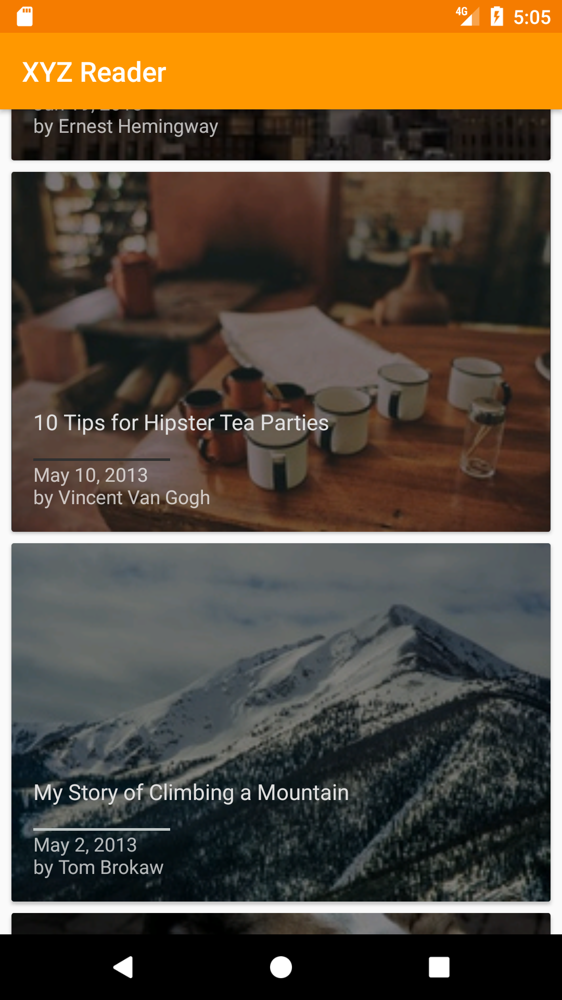
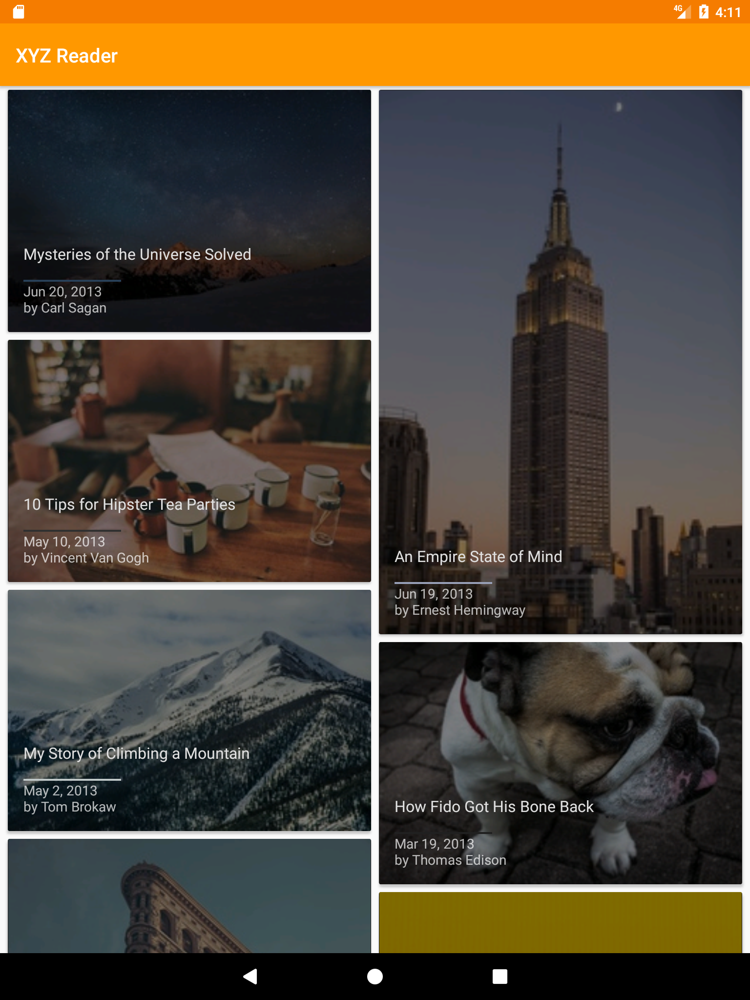
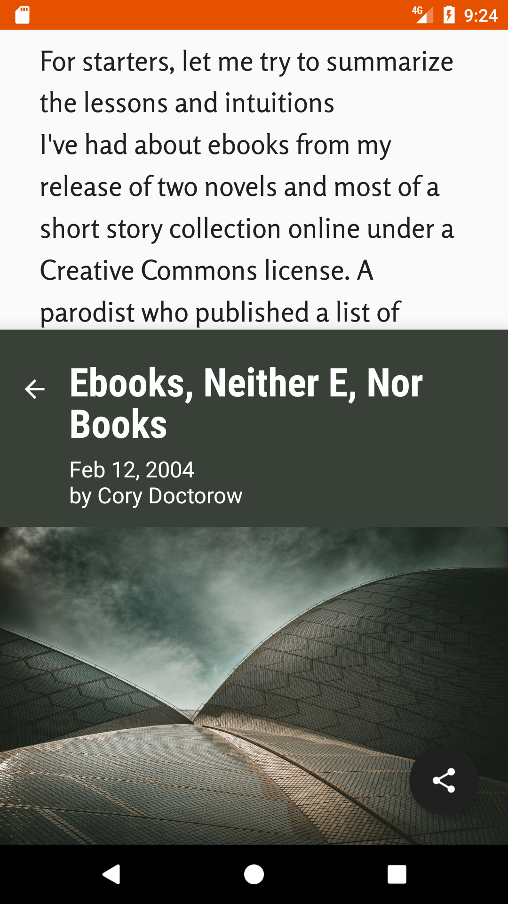
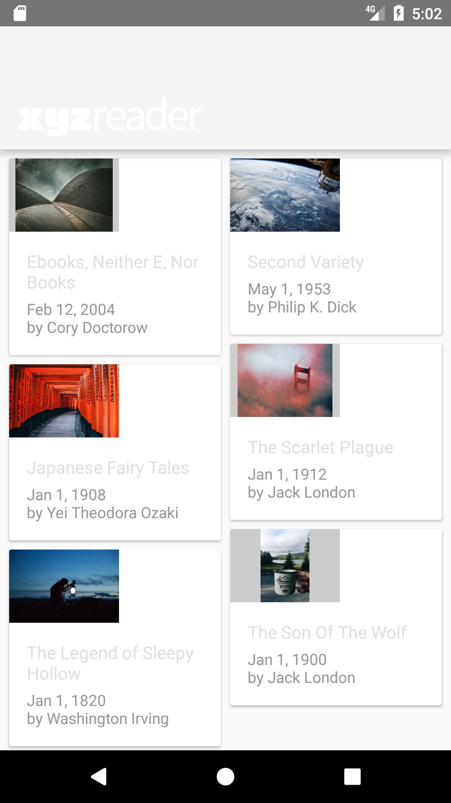
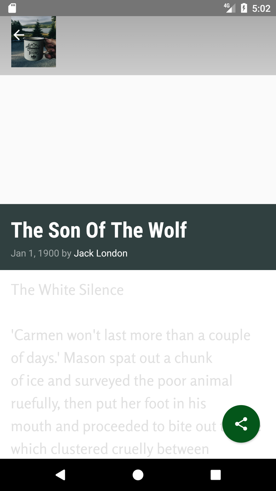

# XYZ Reader Starter Code

This is an app that uses the Volley library to take in a JSON link and populate RSS articles to a RecyclerView. This app uses an old, worn out code and revitalizes it through Material Design. On landscape and larger screens, the RecyclerView uses a StaggeredGridLayout to eliminate empty space, compated to portrait on smaller screens where the RecyclerView uses a cardview LinearLayoutManager. Colors are consistent, animations are quick, and demonstrates sharing of article images and other data. 

Here are images of what the new design looks like: 
### Smaller screen/portrait of the article list

### Larger screen/portrait of the article list with a StaggeredGridLayoutManager for the RecyclerView

### Larger screen/portrait of the detail fragment with a StaggeredGridLayoutManager for the RecyclerView

### Old starter design before revamp

